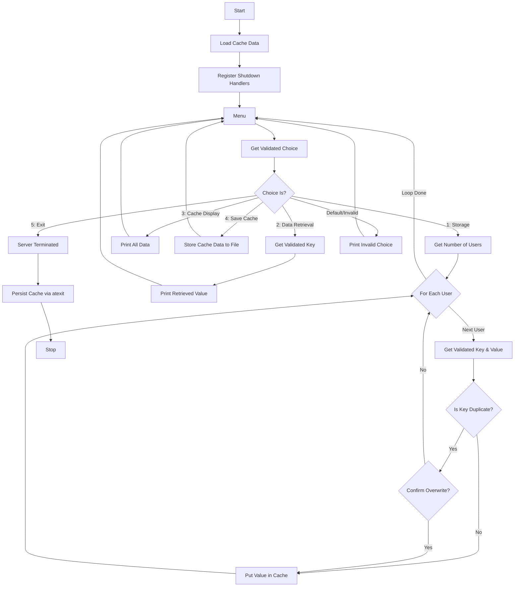

<!--velocache architecture breakdown-->

# Architecture Overview

## 1. High-Level Design

The system is built on two primary data structures that work in tandem to provide constant-time access and ordered eviction.     

- The Core Components:      
    - **Doubly Linked List (DLL):** Manages the "recency" of data. The Head represents the most recently used (MRU) items, while the Tail represents the least recently used (LRU) items.

    - **Hash-Map (std::unordered_map):** Acts as a "GPS" for the cache. It stores keys and maps them directly to the memory address (pointer) of the corresponding node in the DLL. This allows for $O(1)$ lookups. 

    - **Persistence Manager:** A file-based serialization engine that handles "Hydration" (loading state into RAM) and "Dehydration" (saving RAM state to disk).     

## 2. Algorithmic Flow ($O(1)$ Complexity)  

- `getValue(std::string key) `Operation: 

    1. **Lookup:** Check the Hash-Map for the key      
    2. **Cache Hit:** If found, use the pointer to jump directly to the DLL node.       
    3.  **Promote:** Remove the node from its current position in the DLL and re-insert it at the Head.     
    4.  **Return:** Return the value.      

- `putValue(std::string key, std::string value)` Operation:      

    1. **Check Existence:** If the key exists, update the value and Promote to Head.     
    2. **Check Capacity:** If the cache is full, the system identifies the node at the Tail (the oldest data).       
    3. **Evict:** Remove the Tail node from the DLL and erase its entry from the Hash-Map.       
    4. **Insert:** Create a new node at the Head and record its pointer in the Hash-Map.      

### Mermaid Overview

## 3. Persistence & Hydration Logic 

One of velocache's unique features is its **Smart Hydration** policy.    

- **Tail-to-Head Serialization:** When saving the cache to a file, velocache traverses the DLL from the Tail to the Head. 

- **Why?**  When the system restarts and reads the file line-by-line, the items at the end of the file (**the Head/MRU items**) are the last to be inserted into the fresh DLL. This naturally pushes them to the Head of the new list, perfectly reconstructing the cache's "**state of mind**" from before the shutdown.        

## 4. Implementation Details (C++) 

- **Memory Management:** Nodes are dynamically allocated. The system ensures that every Evict call triggers a proper delete to prevent memory leaks in long-running processes.  

- **Header-Only vs. Compiled:** The core engine logic is isolated in `src/cache.cpp` and `include/cache.hpp` to allow for easy integration as a library in other C++ projects.        

- **Optimization:** Uses **-O3 compiler flags** during the build process to maximize throughput, currently clocked at **25,000+ ops/sec**.      